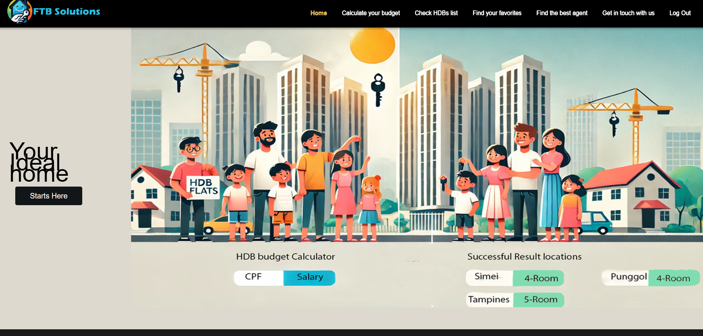

## First Time Buyers (FTB) website
A simple React website that assists first-time buyers to make an informed decision before purchasing their first BTO.

website demo : https://zingy-pudding-2c31ec.netlify.app/home

# Features
-User Login using OAuth- Google authentication  
-Using get from retreive data from public API  
-Pagination when retrieving a huge amount of data  
-Search SalesPerson

### Frontend
- React
- Material UI
- Axios

## Installation
-cd Grp1ReactProjUpdated-main  
-npm install  
-npm start  

## HOME page

## Budget page
 

The objective was to provide users with multiple login methods while learning modern authentication techniques commonly used in web applications.

## What I Learned

### React Development

During this project, I gained experience in:

* Using React Hooks such as `useState`
* Managing form inputs and validation
* Handling user interactions through event handlers
* Building reusable and maintainable components

### Material UI (MUI)

Through this project, I began to understand how to use Material UI (MUI) to build modern and responsive user interfaces in React applications.

I learned how to:

* Use pre-built MUI components such as Buttons, TextFields, Checkboxes, Typography, Cards, Forms, and Links
* Organize page layouts using MUI's `Box` and `Stack` components
* Apply styling through component properties and the `sx` styling system
* Create consistent user interfaces with less custom CSS
* Improve the overall appearance and usability of the application using Material Design principles

Working with MUI helped me develop a better understanding of component-based UI development and how professional React applications can be built efficiently using a UI framework.

### Form Validation

I learned how to:

* Validate email formats using regular expressions
* Enforce password length requirements
* Display meaningful error messages to users
* Prevent invalid data from being submitted

### Routing and Navigation

I learned how to:

* Use React Router's `useNavigate` hook
* Redirect users after successful login
* Manage navigation flow within a React application

### Third-Party Authentication

I gained exposure to:

* Integrating Google Login using OAuth
* Understanding how authentication providers return user credentials and tokens
* Learning how social login can improve user convenience and reduce the need for manual registration

### Firebase Authentication

I learned how to:

* Configure authentication providers
* Use Firebase Authentication APIs
* Implement popup-based authentication flows
* Understand how Firebase simplifies authentication management

## Areas for Improvement

### Google Authentication

Although Google Login was successfully integrated, the implementation can be improved further.

#### Current Implementation

* Authenticates users using Google Sign-In
* Redirects users to the home page after successful login

#### Future Improvements

* Verify the Google ID token on the backend
* Create or update user records in the database
* Store user profile information such as name, email, and profile picture
* Implement JWT-based session management for enhanced security
* Add proper logout and token refresh mechanisms
* Introduce role-based access control if different user types are required

These improvements would make the authentication flow production-ready rather than serving only as a frontend demonstration.

### Form Validation

The current validation logic uses direct DOM access through `document.getElementById()`.

A better approach would be:

* Using React controlled components exclusively
* Leveraging libraries such as React Hook Form
* Centralizing validation logic
* Implementing stronger password policies and additional validation rules

### User Experience Enhancements

Future improvements may include:

* Loading indicators during authentication
* Better error handling and feedback messages
* Remember-me functionality integrated with persistent sessions
* Enhanced accessibility support for users with disabilities

## Facebook Authentication Challenges

Unfortunately, Facebook Login was not fully functional during development.

The authentication code was implemented using Firebase Authentication. However, the login process could not be completed successfully due to Facebook Developer App configuration requirements and OAuth setup challenges.

Some of the challenges included:

* Configuring the Facebook Developer Application correctly
* Setting up valid OAuth redirect URIs
* Meeting Meta's application review and permission requirements
* Limited development time available to troubleshoot and complete the configuration process

Additional Facebook Developer Console configuration and verification would be required before the feature can be deployed successfully in a production environment.

## Singpass Login

The Singpass Login button was implemented as a visual prototype only.

The actual Singpass authentication service was not integrated because:

* Singpass authentication is only available to registered organisations and approved entities
* Access to the Singpass API requires onboarding and approval from the relevant authorities
* This project was developed as a learning and demonstration project and therefore did not qualify for production Singpass integration

As a result, the current implementation simulates a successful login and redirects users to the home page for demonstration purposes only.

## Conclusion

This project provided valuable hands-on experience in React development, Material UI, Firebase Authentication, OAuth-based authentication, form validation, and frontend application design.

I gained a deeper understanding of how modern authentication systems work and how third-party identity providers such as Google, Facebook, and Singpass can be integrated into web applications. While Google Authentication was successfully implemented, I also learned the importance of proper backend verification, security practices, and external provider configuration.

Overall, this project strengthened my frontend development skills and provided practical experience with authentication technologies commonly used in real-world applications.

